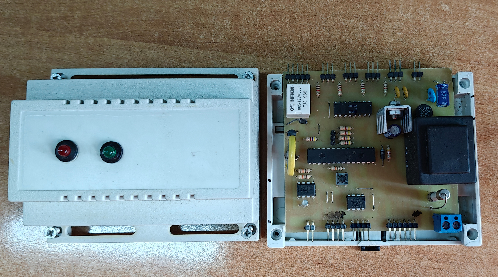

# Centrala alarmowa

Projekt PCB wraz z oprogramowaniem mikrokotrolera PIC18F25K80 w CCS C.
Komunikacja z czytnikiem kart RFID i innymi urządzeniami po magistrali CAN, obsługa czujników ruchu oraz syreny alarmowej.
Konfiguracja centrali przez UART.

